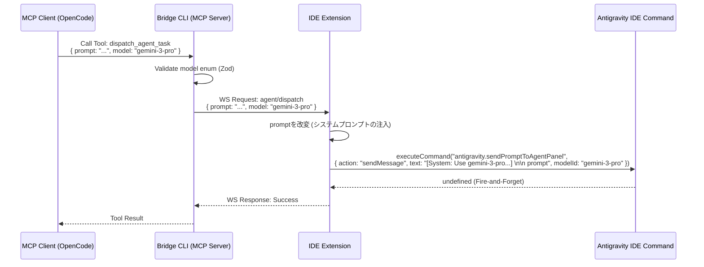

# Antigravity MCP Bridge Specification (v1.3: Model Selection Feature)

## 1. Project Overview

本仕様書は、Antigravity MCP Bridge (v1.2) の既存機能である dispatch_agent_task ツールを拡張し、タスク委譲時に「使用するLLMモデルを指定できる機能」を追加するための要件定義・設計書である。

Antigravity IDEの内部APIがモデル指定パラメータをサポートしていない可能性を考慮し、**「プロンプト自体にモデル指定のシステムプロンプトを自動注入する（フォールバック）」**というハイブリッドなアプローチを採用し、確実なモデル制御を実現する。

## 2. Tech Stack (変更なし)

* **Bridge CLI**: Node.js, @modelcontextprotocol/sdk, zod  
* **Extension**: VS Code Extension API  
* **Shared**: TypeScript

## 3. Architecture (Data Flow)



## 4. Features & Requirements

### FR-01: Model Validation (CLI Layer)

* **優先度**: Must Have  
* **内容**: dispatch_agent_task の引数として model (Optional: String) を受け付ける。  
* **バリデーション**: zod の列挙型 (enum) などを利用し、許可されたモデル名のみを受け付ける。  
  * **許可リスト（例）**:  
    * gemini-3-pro (推奨 / 強力な推論)  
    * gemini-2.5-pro  
    * gemini-2.5-flash (高速)  
    * gemini-2.0-pro-exp  
    * gemini-2.0-flash  
    * gemini-exp-1206  
  * 不正なモデル名が指定された場合は MCP サーバー側でバリデーションエラーを返す。

### FR-02: Model Parameter Passing (Shared Layer)

* **優先度**: Must Have  
* **内容**: Bridge CLI から Extension へ送信される WebSocket メッセージ agent/dispatch の params に model を含める。

### FR-03: Prompt Injection Fallback (Extension Layer)

* **優先度**: Must Have  
* **内容**: Extension側で model パラメータを受け取った際、Antigravity IDEのコマンドに渡すペイロードを構築する。  
* **処理ロジック**:  
  1. APIペイロードに modelId または model として値を直接含める（APIが将来対応したときのため）。  
  2. **【最重要】** model が指定されている場合、元の prompt の先頭に以下のプレフィックスを自動で追加する。  
     [System Directive: You MUST use the '${model}' model for this task. Do not use any other model.]

     ${original_prompt}

  3. この改変されたテキストを action: "sendMessage" の text として送信する。

## 5. Data Structure

packages/shared/src/types.ts を以下の通り拡張する。

```typescript
export interface AgentDispatchParams {  
    prompt: string;  
    model?: string; // [NEW] Optional parameter for model selection  
}
```

## 6. API Definition (MCP Tool Updates)

packages/bridge-cli/src/mcp-server.ts の dispatch_agent_task ツール定義を更新する。

| Tool Name | Action | Arguments (Zod Schema) |
| :---- | :---- | :---- |
| dispatch_agent_task | 変更なし | prompt: z.string().describe("エージェントに送信するプロンプト") model: z.enum(["gemini-3-pro", "gemini-2.5-pro", "gemini-2.5-flash", "gemini-2.0-pro-exp", "gemini-2.0-flash"]).optional().describe("使用するAIモデルの指定（省略時はIDEのデフォルト）") |

## 7. LLM Guidelines (実装用プロンプト)

このドキュメントをAIアシスタントに読み込ませて実装を依頼する際は、以下のプロンプトを使用してください。

"あなたは世界トップクラスのTypeScriptエンジニアです。添付の仕様書 Antigravity_MCP_Bridge_Spec_v1-3.mdに従って、Antigravity MCP Bridgeにモデル指定機能を追加してください。


以下の3つのパッケージを順に修正してください。

1. packages/shared/src/types.ts の AgentDispatchParams に model?: string を追加。  
2. packages/bridge-cli/src/mcp-server.ts の dispatch_agent_task のZodスキーマに model (enum) を追加し、リクエストに含める。  
3. packages/extension/src/handlers.ts の handleAgentDispatch を修正し、model が指定されている場合はプロンプトの先頭に [System Directive: You MUST use the '${params.model}' model for this task.]\n\n を注入してから executeCommand を実行するようにしてください。"
