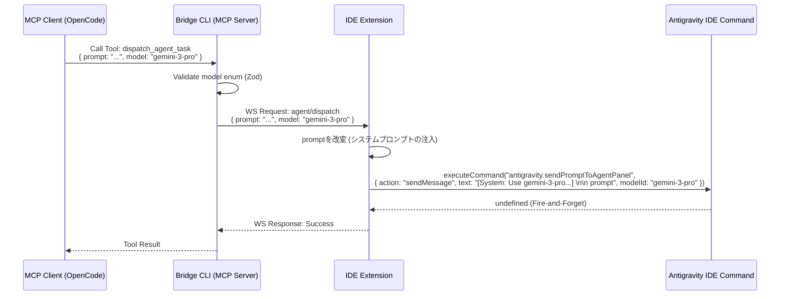

# Antigravity MCP Bridge Specification (v1.3: Model Selection Feature)

## 1. Project Overview

本仕様書は、Antigravity MCP Bridge (v1.2) の既存機能である dispatch_agent_task ツールを拡張し、タスク委譲時に「使用するLLMモデルを指定できる機能」を追加するための要件定義・設計書である。

Antigravity IDEの内部APIがモデル指定パラメータをサポートしていないため、**「SQLite DBに直接アクセスしてモデル設定をパッチし、送信後に復元する」**というアプローチを採用し、確実なモデル制御を実現する。

## 2. Tech Stack (変更なし)

* **Bridge CLI**: Node.js, @modelcontextprotocol/sdk, zod  
* **Extension**: VS Code Extension API  
* **Shared**: TypeScript

## 3. Architecture (Data Flow)


```mermaid
sequenceDiagram  
    participant Client as MCP Client (OpenCode)  
    participant CLI as Bridge CLI (MCP Server)  
    participant Ext as IDE Extension  
    participant API as Antigravity IDE Command

    Client->>CLI: Call Tool: dispatch_agent_task<br>{ prompt: "...", model: "gemini-3-pro" }  
    CLI->>CLI: Validate model enum (Zod)  
    CLI->>Ext: WS Request: agent/dispatch<br>{ prompt: "...", model: "gemini-3-pro" }  
    Ext->>Ext: promptを改変 (システムプロンプトの注入)  
    Ext->>API: executeCommand("antigravity.sendPromptToAgentPanel", <br> { action: "sendMessage", text: "[System: Use gemini-3-pro...] \n\n prompt", modelId: "gemini-3-pro" })  
    API-->>Ext: undefined (Fire-and-Forget)  
    Ext-->>CLI: WS Response: Success  
    CLI-->>Client: Tool Result
```

## 4. Features & Requirements

### FR-01: Model Validation (CLI Layer)

* **優先度**: Must Have  
* **内容**: dispatch_agent_task の引数として model (Optional: String) を受け付ける。  
* **バリデーション**: zod の列挙型 (enum) などを利用し、許可されたモデル名のみを受け付ける。  
  * **許可リスト**: `packages/shared/src/types.ts` の `AG_MODELS` に定義されているモデルを動的に参照する。
  * 不正なモデル名が指定された場合は MCP サーバー側でバリデーションエラーを返す。

### FR-02: Model Parameter Passing (Shared Layer)

* **優先度**: Must Have  
* **内容**: Bridge CLI から Extension へ送信される WebSocket メッセージ agent/dispatch の params に model を含める。

### FR-03: Prompt Injection Fallback (Extension Layer)

* **優先度**: Must Have  
* **内容**: Extension側で model パラメータを受け取った際、Antigravity IDEのコマンドに渡すペイロードを構築する。  
* **処理ロジック**:  
    1. `readModelFromDb()` を呼び出し、現在のモデルIDをバックアップする。
    2. `writeModelToDb(requestedModel)` を呼び出し、SQLite DBに目的のモデルIDを書き込む。
    3. `antigravity.sendPromptToAgentPanel` を呼び出してプロンプトを送信する。
    4. 送信完了後、バックアップしておいたモデルIDを用いて `writeModelToDb()` を呼び出し、元の状態に復元する。

## 5. Data Structure

packages/shared/src/types.ts を以下の通り拡張する。

```typescript
export interface AgentDispatchParams {  
    prompt: string;  
    model?: string; // [NEW] Optional parameter for model selection  
}
```

## 6. API Definition (MCP Tool Updates)

packages/bridge-cli/src/mcp-server.ts の dispatch_agent_task ツール定義を更新する。

| Tool Name | Action | Arguments (Zod Schema) |
| :---- | :---- | :---- |
| dispatch_agent_task | 変更なし | prompt: z.string().describe("エージェントに送信するプロンプト") model: z.enum(["gemini-3-pro", "gemini-2.5-pro", "gemini-2.5-flash", "gemini-2.0-pro-exp", "gemini-2.0-flash"]).optional().describe("使用するAIモデルの指定（省略時はIDEのデフォルト）") |

## 7. LLM Guidelines (実装用プロンプト)

このドキュメントをAIアシスタントに読み込ませて実装を依頼する際は、以下のプロンプトを使用してください。

"あなたは世界トップクラスのTypeScriptエンジニアです。添付の仕様書 Antigravity_MCP_Bridge_Spec_v1-3.mdに従って、Antigravity MCP Bridgeにモデル指定機能を追加してください。


以下の3つのパッケージを順に修正してください。

1. packages/shared/src/types.ts の AgentDispatchParams に model?: string を追加。  
2. packages/bridge-cli/src/mcp-server.ts の dispatch_agent_task のZodスキーマに model (enum) を追加し、リクエストに含める。  
3. packages/extension/src/handlers.ts の handleAgentDispatch を修正し、model が指定されている場合はプロンプトの先頭に [System Directive: You MUST use the '${params.model}' model for this task.]\n\n を注入してから executeCommand を実行するようにしてください。"
